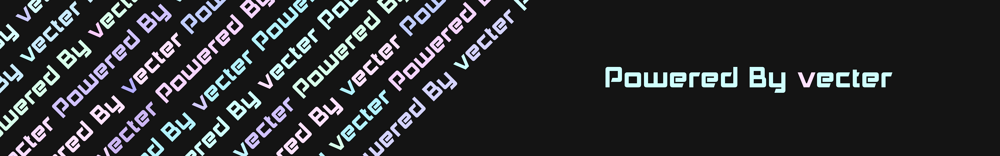

<head>

</head>
<body>

 
<h1> Neko-vecter</h1>

<h2>Project List</h2>
    <ul>
        <li><a href="https://github.com/Neko-vecter/sensor-data-release">Sensor data release</a></li>
            <ul>
                <li>Sensor config for printer</li>
            </ul>
    </ul>

</body>