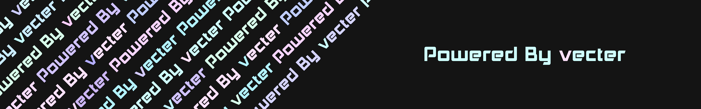

<head>

</head>
<body>

 
<h1> Neko-vecter</h1>

<h3>Project Currently in Progress</h3>
    <ul>
        <li><a href="https://github.com/Neko-vecter/moonraker-mirror-toolkit">Moonraker Mirror Toolkit</a></li>
            <ul>
                <li><a href="https://github.com/Neko-vecter/moonraker">Config mirror version Moonraker</a></li>
            </ul>
        <li><a href="https://github.com/Neko-vecter/OrcaSlicer">OrcaSlicer</a></li>
        <li><a href="https://neo.bttwiki.com">BigTreeTech WiKi NEO</a></li>
        <li><a href="https://github.com/Neko-vecter/sensor-data-release">Sensor data release</a></li>
            <ul>
                <li>Sensor config for printer</li>
            </ul>
    </ul>

    

    
    

</body>
